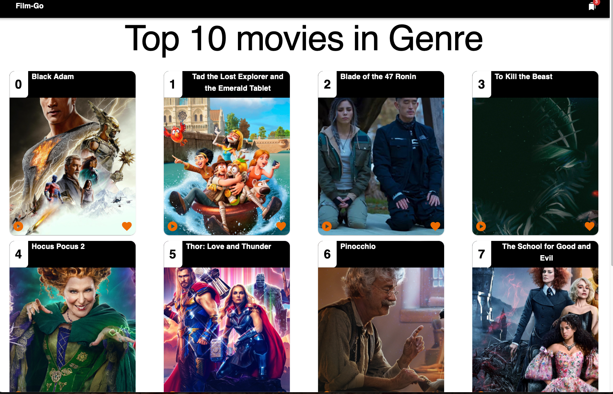
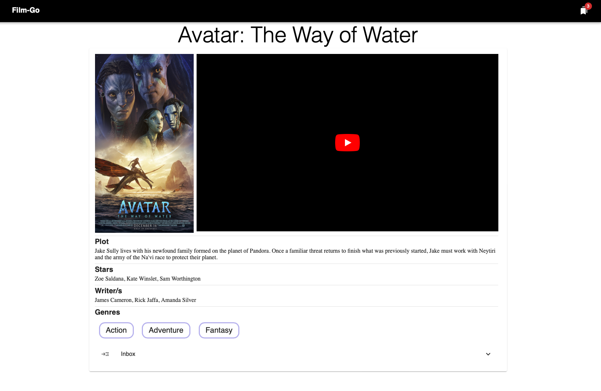

# week11-HW

# Links

[Heroku deployed app 💾](https://dry-savannah-76805.herokuapp.com)

# Table of Contents

- [Description](#description)
- [Installation](#Installation)
- [Usage](#Usage)
- [License](#License)
- [Contributing](#Contributing)
- [Tests](#Tests)
- [Questions](#Questions)

## Description

This app allows a user to save, check and delete notes. This app uses a JSON file as a database. Via the use of API routes through the backend.

Film go is a movie aggregator site app that helps movie geeks find their next movie to watch. We have everything from looking for a movie title, to getting a suggestion list for each genre! Don't forget to bookmark your movies to save your favorite suggestions.

## Installation

To run the app in the local server, clone the repository to your local memory follow the instructions below:

```
cd / Film-Go-react
npm install
npm start       <--- To run the app in a localhost
```

## Usage

```
Technologies used:
JavaScript - React.js - MaterialUI - JSON - Github Pages - React.context - Local Storage

```

- Below are screenshots of the deployed app in Heroku:
  

  

  

Functionality: - Allows user to take search for, bookmark , watch the trailer of and a suggestion list of movies.

# License

This project is not covered by a license.

## Contributing

No contribution

## Tests

No tests available for this task.

## Questions:

GitHub: https://github.com/frsargua

email: frsargua@gmail.com
